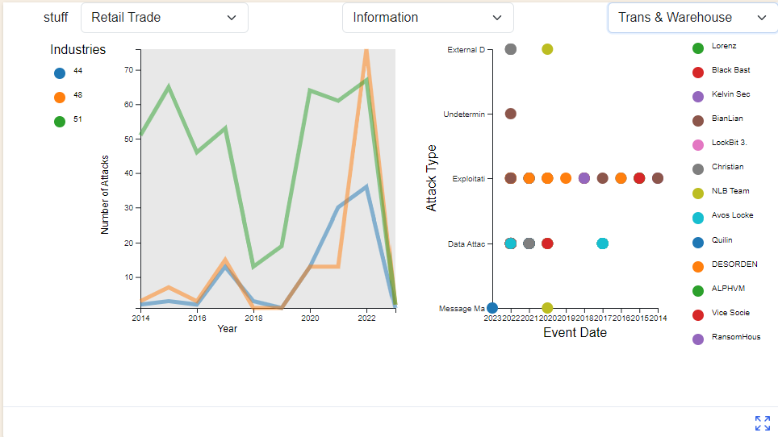

# Data Visualization Project

## Data

-The data for this visualization project is a Cyber Security Attack dataset from the University of Maryland's CISSM Cyber Attacks Database.

-This dataset provides information related to the tactics of know Cyber actors, against organizations catagorized by industry type from Jan 1 2014 to Dec 29 2023. 

-An example of one data entry with the following attributes (though some maybe be null):

    "evtDate": "2023-12-29",
    
    "actor": "Avos Locker",
    
    "actor_type": "Criminal",
    
    "organization": "Stratford University",
    
    "industry_code": 61,
    
    "industry": "Educational Services",
    
    "motive": "Financial",
    
    "event_type": "Mixed",
    
    "event_subtype": "Data Attack",
    
    "description": "Stratford University, discloses a ransomware attack, probably by the Avos Locker gang.",
    
    "source_url": "https://www.databreaches.net/stratford-university-discloses-ransomware-attack-but-which-ransomware-attack/",
    
    "country": "United States of America",
    
    "actor_country": "Undetermined",
    
    "year": null,
    
    "num_attacks": null
    
    
-University of Maryland's CISSM Cyber Attacks Database.
  https://cissm.liquifiedapps.com/
  
-The dataset is made available for download through Russ McRee's paper Internet Storm Center: Exploratory Data Analysis with CISSM Cyber Attacks Database - Part 1
  https://isc.sans.edu/diary/Exploratory+Data+Analysis+with+CISSM+Cyber+Attacks+Database+Part+1/29816
  
-The data can be loaded in csv format directly from the project's github repo
  https://github.com/holisticinfosec/CISSM-EDA

-The data is cleaned and parsed into two different subsets of data used to provide the two different visualizations.
 Full Cyber Attack Data is used to create these two subsets: 
 -"NewData" is json formated like this example:
```yaml
[
  {
    "evtDate": "2023-12-29",
    "actor": "Avos Locker",
    "actor_type": "Criminal",
    "organization": "Stratford University",
    "industry_code": 61,
    "industry": "Educational Services",
    "motive": "Financial",
    "event_type": "Mixed",
    "event_subtype": "Data Attack",
    "description": "Stratford University, discloses a ransomware attack, probably by the Avos Locker gang.",
    "source_url": "https://www.databreaches.net/stratford-university-discloses-ransomware-attack-but-which-ransomware-attack/",
    "country": "United States of America",
    "actor_country": "Undetermined",
    "year": 2023,
    "num_attacks": null
  }
]
```
 -"YearlyData" is json formated like this example:
```yaml
[
  {
    "industryCode": 11,
    "year": 2014,
    "count": 1,
    "industryName": "Agriculture, Forestry, Fishing and Hunting",
    "UTCyear": "2014-01-01T00:00:00.000Z"
  }
]
```

## Questions & Tasks

The following tasks and questions where the initial driving force in the development of the visualization and interactions for the project:

 * What types of industries are targeted most across time?
 * What attackers are most active across time?
 * Is there any correlation between the types of industry and the attacker?
 * What types of attacks are used by actors against their targets?


## Sketches
This sketch shows the initially planned for 3 visualizations to display different data depending on the selections made in each. Ultimately the third viz was dropped from the concept. Showing two viz's on the same screen hightlighted the difficulty of showing three without crowding the screen. 
[

Viz 1 : A line graph showing the number of attacks in each year by Industry Code.

Viz 2 : A scatter plot showing the Actor attacks across time, each circle representing an actor/attacker.

Viz 3 : A Bar graph showing the count of each attack type carried out by an actor.

Selecting a line (representing an Industry Code) in the line graph will highlight all the attack events against that industry type in Viz 2.

Selecting a circle (representing an Actor) in the scatter plot will display all the attacks carried out by that actor over time, by count of attack in the Viz 3 bar graph. 


## Prototypes

The initial prototypes tried to address the abundance of data by showing a limited subset of the data, this was later changed to allow users to select up to three industry codes to show at at time. Eventually, all data was presented in the line graph but with the added functionality of allowing users to roll over and click on an industry to highlight their data in the main viz while at the same time updating the second viz with data related to that industry. The following images represent the iterations of these concepts.  

The first is a line graph showing the number of attacks in each year by Industry Code (type).
[](https://vizhub.com/python-monty/cyber-attacks-by-year-v3)

The second is a scatter plot showing the Actor attacks across time, each cirle representing and industry code (type).
[](https://vizhub.com/python-monty/cyber-attack-scatterplot-final-v1)

Intermediate verison of the project.
[](https://vizhub.com/python-monty/cyber_attacks_combined_final_v3)

Final/Current version the project. 
[](https://vizhub.com/python-monty/cyber_attacks_final_draft)


## Open Issues
* Some of the formatting is still not ideal, namely the handling of the color legend text information.  Limited the length of the text might help resolve this.
* Adding additional labels to each viz would help the user understand what is being displayed
* Adding interaction of the mouse icon so it changes when over clickable items would help with user interaction
* Changing the circles in the second viz to weighted circles would be a good way to represent datapoints that have multiples.  Presently, this is not clear in the currect configuration. 

## Updated Progress
Continued to work on multi viz display.  Attempted to find a way to show all the data and legend entries without crowding the presentation.  Since I'm now showing all the data, I removed the dropdown menus from the previous versions. Also removed industry codes and replaced with industry names for better clarification of data. Clicking in the "Industries" legend populates the Actor/Attack Type viz with data for that industry. Still need to add shading out all non-selected industry groups and creating more color options since these ones repeat. 


