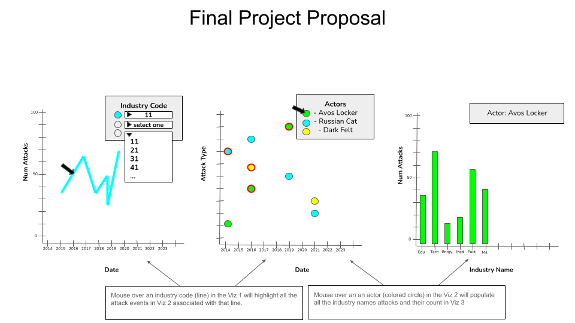
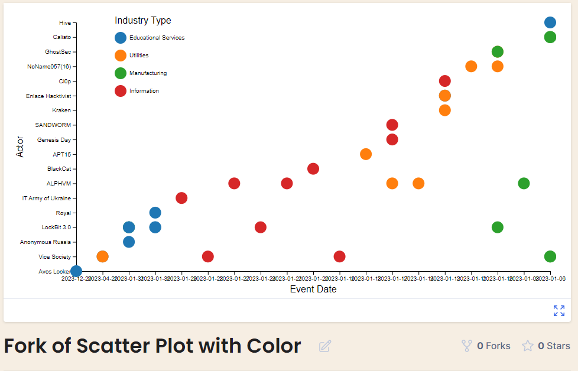
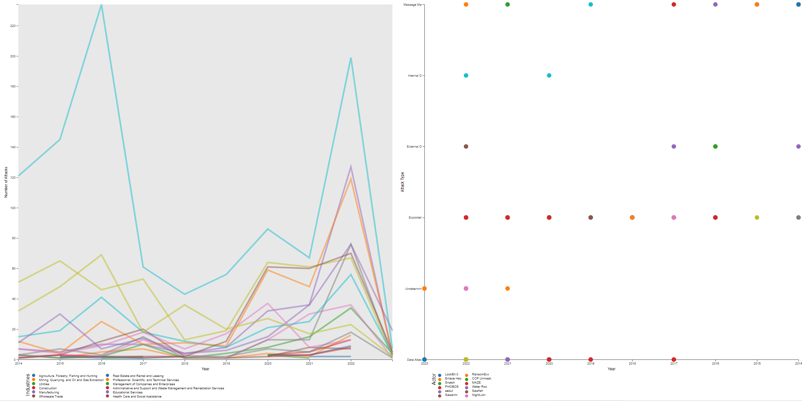

# Data Visualization Project

## Data

-The data for this visualization project is a Cyber Security Attack dataset from the University of Maryland's CISSM Cyber Attacks Database.

-This dataset provides information related to the tactics of know Cyber actors, against organizations catagorized by industry type from Jan 1 2014 to Dec 29 2023. 

-An example of one data entry with the following attributes (though some maybe be null):

    "evtDate": "2023-12-29",
    
    "actor": "Avos Locker",
    
    "actor_type": "Criminal",
    
    "organization": "Stratford University",
    
    "industry_code": 61,
    
    "industry": "Educational Services",
    
    "motive": "Financial",
    
    "event_type": "Mixed",
    
    "event_subtype": "Data Attack",
    
    "description": "Stratford University, discloses a ransomware attack, probably by the Avos Locker gang.",
    
    "source_url": "https://www.databreaches.net/stratford-university-discloses-ransomware-attack-but-which-ransomware-attack/",
    
    "country": "United States of America",
    
    "actor_country": "Undetermined",
    
    "year": null,
    
    "num_attacks": null
    
    
-University of Maryland's CISSM Cyber Attacks Database.
  https://cissm.liquifiedapps.com/
  
-The dataset is made available for download through Russ McRee's paper Internet Storm Center: Exploratory Data Analysis with CISSM Cyber Attacks Database - Part 1
  https://isc.sans.edu/diary/Exploratory+Data+Analysis+with+CISSM+Cyber+Attacks+Database+Part+1/29816
  
-The data can be loaded in csv format directly from the project's github repo
  https://github.com/holisticinfosec/CISSM-EDA

-The data is cleaned and parsed into two different subsets of data used to provide the two different visualizations.
 Full Cyber Attack Data is used to create these two subsets: 
 -"NewData" is json formated like this example:
```yaml
[
  {
    "evtDate": "2023-12-29",
    "actor": "Avos Locker",
    "actor_type": "Criminal",
    "organization": "Stratford University",
    "industry_code": 61,
    "industry": "Educational Services",
    "motive": "Financial",
    "event_type": "Mixed",
    "event_subtype": "Data Attack",
    "description": "Stratford University, discloses a ransomware attack, probably by the Avos Locker gang.",
    "source_url": "https://www.databreaches.net/stratford-university-discloses-ransomware-attack-but-which-ransomware-attack/",
    "country": "United States of America",
    "actor_country": "Undetermined",
    "year": 2023,
    "num_attacks": null
  }
]
```

[
  {
    "industryCode": 11,
    "year": 2014,
    "count": 1,
    "industryName": "Agriculture, Forestry, Fishing and Hunting",
    "UTCyear": "2014-01-01T00:00:00.000Z"
  }
]

## Questions & Tasks

The following tasks and questions will drive the visualization and interaction decisions for this project:

 * What types of industries are targeted most across time?
 * What attackers are most active across time?
 * Is there any correlation between the types of industry and the attacker?
 * What types of attacks are used by actors against their targets?

## Week13 Self Critique of Initial Questions/Tasks

 * What types of industries are targeted most across time?
 *     This question is answered in the CyberAttacks LineChart - Final Project Draft v2, though the original concept has changed a bit. Originally, the graph would show all the data points for all the Industry Codes in the dataset. This proved to be way too much to show at once. Based on a comment from another student, I added the ability for the user to select up to three Industry Codes at the same time to compare.
 * What attackers are most active across time?
 *     This question is not really answered anymore.  I've change the overall concept mainly due to handling overcrowding of data on the screen. The right question now is "What type of attacks and by which actors target a specific industry code over time?"  This question is answered by the CyberAttacks ScatterPlot - Final Project Draft v1
 * Is there any correlation between the types of industry and the attacker?
 *     This question will still be answered if the third viz is developed. The third will show a graph of one Actor and now many times they attacked each industry name. 
 * What types of attacks are used by actors against their targets?
 *     This is answered in the CyberAttacks ScatterPlot - Final Project Draft v1. It shows (for industry selected by the user) Which attacks were carried out, but which actors in what year. 

## Sketches
This sketch shows 3 different visualizations that display different data depending on the selections made in each. 
[

Viz 1 : A line graph showing the number of attacks in each year by Industry Code.

Viz 2 : A scatter plot showing the Actor attacks across time, each circle representing an actor/attacker.

Viz 3 : A Bar graph showing the count of each attack type carried out by an actor.

Selecting a line (representing an Industry Code) in the line graph will highlight all the attack events against that industry type in Viz 2.

Selecting a circle (representing an Actor) in the scatter plot will display all the attacks carried out by that actor over time, by count of attack in the Viz 3 bar graph. 


## Prototypes

I’ve created a few proof of concept visualizations of this data. 

The first is a line graph showing the number of attacks in each year by Industry Code (type).

[

https://vizhub.com/python-monty/cyber-attacks-by-year-v3

The second is a scatter plot showing the Actor attacks across time, each cirle representing and industry code (type).

[

https://vizhub.com/python-monty/cyber_attack_scatterplot_with_legend


## Open Questions

Since there are so many Industries as well as Actors...I'm not sure how I can represent all the datapoints in a clear manner.

I'm not sure how to use the actions in one viz to change data in another at this point. 

## Milestones (readdressed)

week 13 - Link Line and Scatter Plots

week 14 - Create bar graph and link to Scatter Plot

week 15 - Clean up formatting/Fix Bugs

week 16 - Fix bugs/Finish/Present Project

## Updated Progress
Continued to work on multi viz display.  Attempted to find a way to show all the data and legend entries without crowding the presentation.  Since I'm now showing all the data, I removed the dropdown menus from the previous versions. Also removed industry codes and replaced with industry names for better clarification of data. Clicking in the "Industries" legend populates the Actor/Attack Type viz with data for that industry. Still need to add shading out all non-selected industry groups and creating more color options since these ones repeat. 
[


