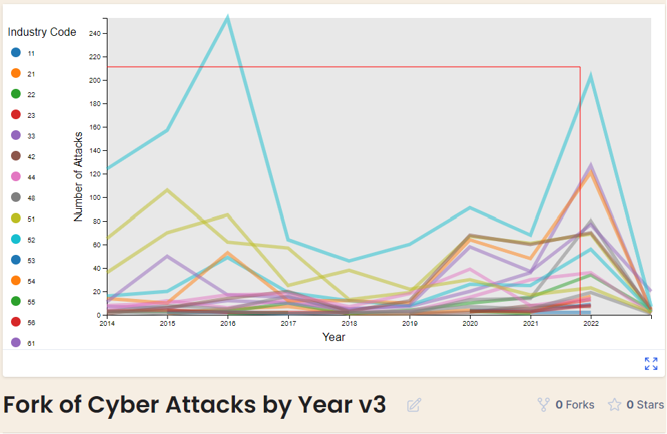

# Data Visualization Project

## Data

-The data I propose to visualize for my project is a Cyber Security Attack dataset from the University of Maryland's CISSM Cyber Attacks Database.
-This dataset provides information related to the tactics of know Cyber actors, against organizations catagorized by industry type from Jan 1 2014 to Dec 29 2023. 
-An example of one data entry with the following attributes (though some maybe be null):
    "evtDate": "2023-12-29",
    "actor": "Avos Locker",
    "actor_type": "Criminal",
    "organization": "Stratford University",
    "industry_code": 61,
    "industry": "Educational Services",
    "motive": "Financial",
    "event_type": "Mixed",
    "event_subtype": "Data Attack",
    "description": "Stratford University, discloses a ransomware attack, probably by the Avos Locker gang.",
    "source_url": "https://www.databreaches.net/stratford-university-discloses-ransomware-attack-but-which-ransomware-attack/",
    "country": "United States of America",
    "actor_country": "Undetermined",
    "year": null,
    "num_attacks": null
    
-University of Maryland's CISSM Cyber Attacks Database.
  https://cissm.liquifiedapps.com/
-The dataset is made available for download through Russ McRee's paper Internet Storm Center: Exploratory Data Analysis with CISSM Cyber Attacks Database - Part 1
  https://isc.sans.edu/diary/Exploratory+Data+Analysis+with+CISSM+Cyber+Attacks+Database+Part+1/29816
-The data can be loaded in csv format directly from the project's github repo
  https://github.com/holisticinfosec/CISSM-EDA

## Questions & Tasks

The following tasks and questions will drive the visualization and interaction decisions for this project:

 * What types of industries are targeted most across time?
 * What attackers are most active across time?
 * Is there any correlation between the types of industry and the attacker?
 * What types of attacks are used by actors against their targets?

## Sketches
This sketch shows 3 different visualizations that display different data depending on the selections made in each. 

Viz 1 : A line graph showing the number of attacks in each year by Industry Code.
Viz 2 : A scatter plot showing the Actor attacks across time, each cirle representing and industry code (type).
Viz 3 : A Bar graph showing the count of each attack type carried out by an actor.

Selecting a line (representing an Industry Code) in the line graph will highlight all the attack events against that industry type in Viz 2.
Selecting a circle (representing an Actor) in the scatter plot will display all the attacks carried out by that actor over time, by count of attack in the Viz 3 bar graph. 


## Prototypes

I’ve created a few proof of concept visualizations of this data. 

The first is a line graph showing the number of attacks in each year by Industry Code (type).
[
https://vizhub.com/python-monty/cyber-attacks-by-year-v3

The second is a scatter plot showing the Actor attacks across time, each cirle representing and industry code (type).
[
https://vizhub.com/python-monty/cyber_attack_scatterplot_with_legend


You can put images into here by pasting them into issues.
You can make images into links like this:
```
[](https://vizhub.com/curran/eab039ad1765433cb51aad167d9deae4)
```
Also, you can study the [source](https://raw.githubusercontent.com/curran/dataviz-project-template-proposal/master/README.md) to figure out Markdown formatting. You can use the GitHub built-in editor to edit the document.

## Open Questions

Since there are so many Industries as well as Actors...I'm not sure how I can represent all the datapoints in a clear manner.
I'm not sure how to use the actions in one viz to change data in another at this point. 

## Milestones
week 9 - Complete design concept
week 10 - Clean up bugs in existing Line and Scatter plot
week 11 - Link Line graph to scatter plot
week 12 - Begin creating the bar graph
week 13 - Complete the bar graph
week 14 - Link the scatter plot to the bar graph
week 15 - Add any new functionality if possible
week 16 - Fix bugs/Finish/Present Project
